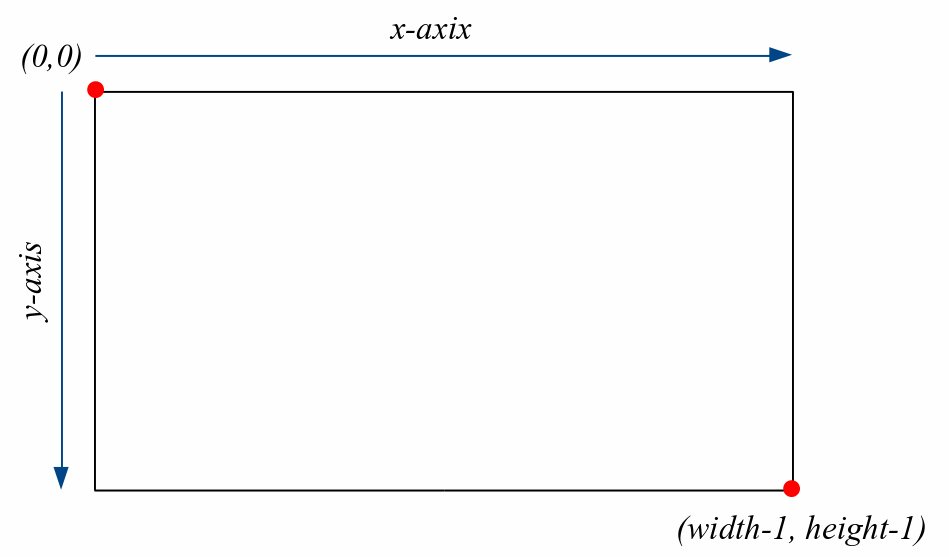
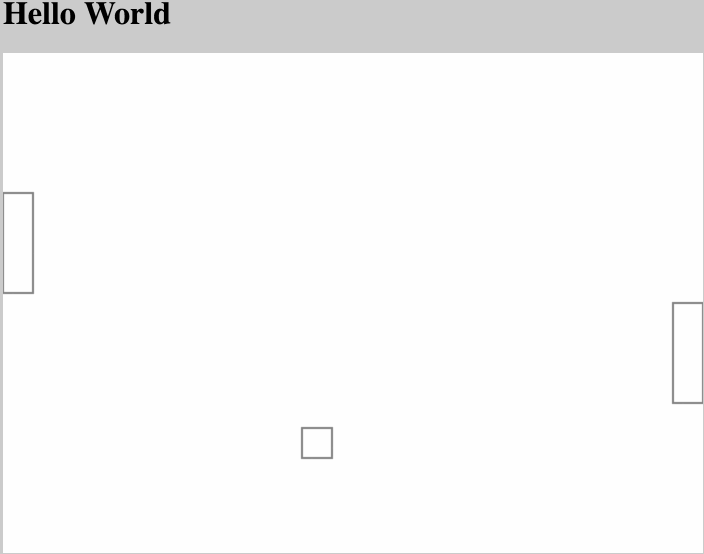
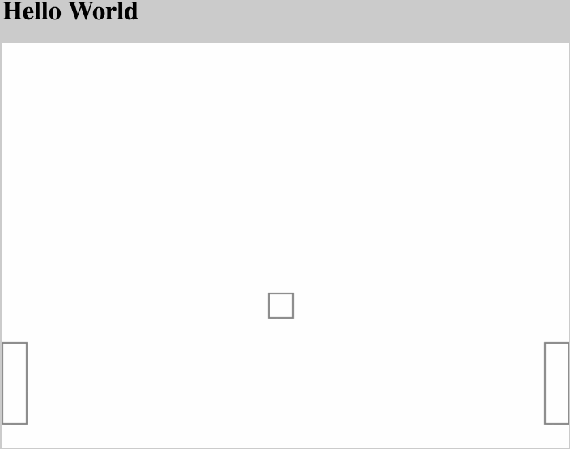
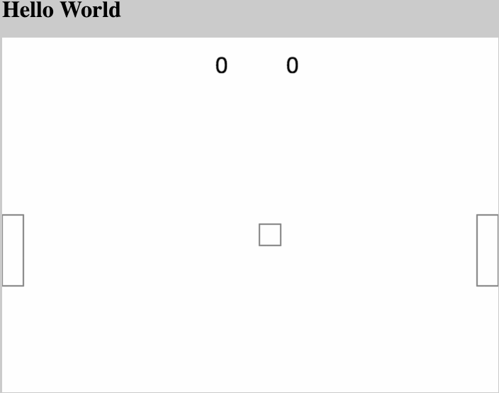

# Pong Tutorial
In this tutorial, we'll learn how to make a simple version of the old-school game **pong**.

This assumes some knowledge of html, css, and javascript. If you've done one or two tutorials in these then you should be good to go!

## Step 1: Hello World
Its tradition to start every project off with a basic "hello world." I find this really useful personally because it ensures that I know exactly how to run the thing that I'm creating.

So that's the first step. You can see the code for it [here](https://github.com/scottopell/pong-tutorial/blob/07cbeff4dc7b19518ec54ca0d07eec51dbebe0db/index.html). And this doesn't do anything exciting, if you open this file in your browser, then you'll just see this:


## Step 2: Best Practices
So far, so good. We have a pretty standard HTML file with just the absolute bare minimum.

Now we're going to add a few things to this, but still no actual content. There are three:

```
<meta charset="utf-8">
<title>Pong</title>
<meta name="description" content="Pong Game">
```
 
1. This is something that tells the browsers how to render the characters on the page. This probably doesn't make any sense and that's okay, we don't have to worry about this at all.
2. This sets a title for the page. This is what you see at the top of the tab in your browser. (**Try it out!**, change "Pong" to whatever you want)
3. This sets some information about the page. This is used by web crawlers, so when Google finds your site, they'll know that its a game!

Full code at this stage can be found [here](https://github.com/scottopell/pong-tutorial/blob/8624de767b6c0a472a8982bae9e1122ccbc2fbc2/index.html).
## Step 3: Some Javascript (and Events!)
When you use javascript in the browser, most of the time you only want to run code in response to something. These "somethings" are called events and one common example is a "click" event. These "fire" when a user clicks on anything on the page.

Another type of event is called the "load" event. This event fires when the page is done loading. By default, any code you write will run as soon as possible, which is often before the browser is done loading all the elements on the page.

For most code, you want it to run only after all the elements of the page, the titles, the paragraphs, the links, have all loaded.

So, in order to make this happen, we can _register_ our code to only run when certain events _fire_.

```javascript
function foo(){
  console.log("Everything is loaded!");
}
window.addEventListener("load", foo, false);
```

In this example, we told the browser
> "Hey, run the code in the function "foo" when the page loads."

You can see code similar to this right [here](https://github.com/scottopell/pong-tutorial/commit/fc16ff591e7f806918584a31ba7a3bb733df1d9e).

## Step 4: Painting!
A few years ago, the people that make browsers realized that it was too hard to draw just random shapes in the HTML. HTML was built to present text and images in various ways.
So, to fix this, they added the `<canvas>` element.

**Canvas** is a good name because the best way to think about it is as if it were a big piece of paper and you had a pen that you had to move around and decide when to put it down on the paper, or pick it up (so it doesn't make a mark).

A canvas will always just be an empty HTML tag, but its useful to give it an `id` and a width and height.

```html
<canvas id="mycanvas" width=700px height=500px></canvas>
```

Then you control this entirely through javascript. Here's an example.

```js
var canvas = document.getElementById('mycanvas');
var ctx = canvas.getContext('2d');

// strokeRect's first two parameters are X and Y coordinates
// then the third and fourth parameters are the lengths of the sides
ctx.strokeRect(50, 100, 150, 150);
```

This draws, exactly what you'd expect, a square!


Find the code for the current version [here](https://github.com/scottopell/pong-tutorial/commit/753213bd81f98abd42fa9b018e8bede038bbcfa5).
## Step 5: Drawing the game
So, now that we know how to draw rectangles, that's basically all we need!

Before reading any further, take a minute to try to recreate this:


Notice that I made the background of the page grey and kept the background of the canvas white to be able to see where the canvas begins and ends.

```css
body {
  background-color: #cccccc;
}
canvas {
  background-color: white;
}
```


Did you already try to do it on your own? Okay, keep scrolling for the answer.

<br>
<br>
<br>
<br>
<br>
<br>

**Answer**

```js
var paddleWidth = 30;
var paddleHeight = 100;
var totalWidth = 700;
var totalHeight = 500;

var ballSize = 30;

// player one's paddle
ctx.strokeRect(0,
    totalHeight / 2,
    paddleWidth,
    paddleHeight);

// player two's paddle
ctx.strokeRect(totalWidth - paddleWidth,
    totalHeight / 2,
    paddleWidth,
    paddleHeight);

// "ball"
ctx.strokeRect(totalWidth / 2,
    totalHeight / 2,
    ballSize,
    ballSize);
}
```

This code starts off by defining the sizes of the different elements. 

`paddleWidth` and `paddleHeight` are exactly what they sound like, and its convenient to put them in a variable like this so we can have calculations with them.

`totalWidth` and `totalHeight` define the size of the canvas, and these are how we can put player two's paddle up against the right edge.

`ballSize` is the length of the sides of the square that we'll use as our ball.

So, putting all this together, we can draw 3 rectangles to get the above pictures.

Play around with this code to try to move the ball around a bit!

Current code can be found [here](https://github.com/scottopell/pong-tutorial/commit/94dfd3696e3cebd19bb24ea78f5cd6782c432865)

## Step 6: Making Things Move
Great, so we know how to draw some rectangles. But this is basically just what we can do in photoshop or mspaint or snapchat.

Now we want to make these things move around. The idea here is the same as flipbooks, or movies, each time you want to move an object, you redraw everything, but move that thing just a little bit.

So the general idea in code looks like this

```
square.x_pos = 0;
square.y_pos = 0;

while (true) {
  draw(square);
  square.x_pos++;
  square.y_pos++;
  erase_canvas();
}
```

What this will do is make the `square` move one pixel to the right and one pixel down every time the loop runs.

Now lets see if we can make our `ball` move using this same principal.

Unfortunately, in the browser, we can't just use an infinite while loop as we did in the code above. If you do, then the browser will hang forever because your code will be running forever!

So, the solution to this to just schedule our code to run every **16 milliseconds**. Where does this number come from? A standard _frame rate_ is 60 frames per second (fps.) At this frame rate, things look pretty natural and there's not much need to go faster.

Javascript includes a way to tell the browser "run this code in N milliseconds."

```js
window.setTimeout(mainLoop, 16);
```

So to make this last forever, we'll have to do it ourselves:

```js
window.setTimeout(mainLoop, 16);
function mainLoop(){
    drawStuff()
    window.setTimeout(mainLoop, 16);
}
```

So, if we put all this together and put it into code, we get something like this:

```js
function init(){
  canvas = document.getElementById('mycanvas');
  ctx = canvas.getContext('2d');

  window.setTimeout(mainLoop, 16);
}

function mainLoop(){
  drawStuff();
  ball_x++;
  ball_y++;
  window.setTimeout(mainLoop, 16);
}

function drawStuff(){
  // player one's paddle
  draw_paddle(ctx,
      0,
      totalHeight / 2,
      paddleWidth,
      paddleHeight);

  // player two's paddle
  draw_paddle(ctx,
      totalWidth - paddleWidth,
      totalHeight / 2,
      paddleWidth,
      paddleHeight);

  draw_ball(ctx, ball_x, ball_y, ballSize);
}

function draw_paddle(ctx, x, y, width, height){
  ctx.strokeRect(x, y, width, height);
}

function draw_ball(ctx, x, y, size){
  ctx.strokeRect(x, y, size, size);
}
```

This gives you a result that looks like this:


Almost what we want. I left out a crucial step. I didn't clear the canvas before drawing the box in its new position.

If I clear the canvas, then I get exactly what we're looking for!


## Step 7: Making things bounce
So, now that we know the basic idea behind moving items on the screen, lets step back for a second and see if we can figure out a way to make the ball bounce off the edges of the screen.

Conceptually, what we want to do here, is see when the position of the ball goes below the bottom edge, to the right of the right edge, to the left of the left edge, or above the top edge.

So given some point `x,y` as the coordinate, we can write a function that looks like this:

```js
function ballCollisionHandler(x, y){
  if (x > canvas.width){
      // switch the ball to travel left instead of right
  } else if (x < 0){
      // switch the ball to travel right instead of left
  } else if (y > canvas.height){
    // switch the ball to travel upwards instead of downwards
  } else if (y < 0){
    // switch the ball to travel downwards instead of upwards
  }
}
```


Now as you might have noticed, this assumes the ball is a single `x,y` point, but it has width and height!

So lets take that into account, its not hard!

```js
function ballCollisionHandler(x, y){
  if (x + ballSize > canvas.width){
      // switch the ball to travel left instead of right
  } else if (x < 0){
      // switch the ball to travel right instead of left
  } else if (y + ballSize > canvas.height){
    // switch the ball to travel upwards instead of downwards
  } else if (y < 0){
    // switch the ball to travel downwards instead of upwards
  }
}
```

That looks better. Now we can add in some code that will tell the ball what to do when it reaches an edge. For now, lets just let tell it to stop moving to make sure it works.


Awesome! For the next stage, we'll talk about how to make the ball "bounce" off the edges!

Code for this stage found [here!](https://github.com/scottopell/pong-tutorial/blob/291940878184849fcb6cfb25f13c9dd40adb2538/index.html#L33)


## Step 8: Bouncing Around
So in the last step, we got it so that we know when the ball hits an edge. Now we need to figure out how to make it bounce off the edges like you'd expect!

So, conceptually, what we're currently doing is adding 1 to the position of the ball every time our loop runs (which is about 30 times per second.)

Now, the way canvas' numbering system works, at the very top right is the point (0,0), which explains why adding 1 to each x and y makes it go down and to the right.



So now, we can see that if we want to make the ball go up and to the left, we should do

```js
ball_x = ball_x - 1;
ball_y = ball_y - 1;
```

Lets test out this theory and modify our core loop to do this:

```js
function mainLoop(){
  drawStuff();

  ball_x = ball_x - 1;
  ball_y = ball_y - 1;
  window.setTimeout(mainLoop, 16);
}
```

And when we run it, we see exactly what expect!

So, given this information, we can fill in the comments that we put in `ballCollisionHandler` earlier!

```js
function ballCollisionHandler(x, y){
  if (x + ballSize > canvas.width){
    // switch the ball to travel left instead of right
    ball_x_velocity = -1;
  } else if (x < 0){
    // switch the ball to travel right instead of left
    ball_x_velocity = 1;
  } else if (y + ballSize > canvas.height){
    // switch the ball to travel upwards instead of downwards
    ball_y_velocity = -1;
  } else if (y < 0){
    // switch the ball to travel downwards instead of upwards
    ball_y_velocity = 1;
  }
}
```

And `ball_x_velocity` and `ball_y_velocity` are used in our main loop like this:

```js
function mainLoop(){
  drawStuff();

  ballCollisionHandler(ball_x, ball_y);
  ball_x += ball_x_velocity;
  ball_y += ball_y_velocity;
  window.setTimeout(mainLoop, 16);
}
```

(Make sure to define these where we define the other ones too!)

Now, lets test out this version and make sure it works.


It works!!

If you noticed, it currently doesn't collide with the paddles, because we didn't define what that would look like in `ballCollisionHandler`.

In the next steps, we'll be adding in the ability to move each paddle and make the ball bounce off of this too!

Code for this section found [here!](https://github.com/scottopell/pong-tutorial/blob/c2bca26db6eaad46193907880bb6d0e9e62de5e3/index.html#L34)


## Step 9: Controlling Paddles
In order to control the paddles, we're going to basically add a "handler" for the "keydown" event. This means that whenever a key get pressed on the keyboard, we can run some custom code!

The basic idea here is this

```js
window.addEventListener('keydown', function(e){
    if (e.keyCode == NUMBER_FOR_DOWN_ARROW){
        // move paddle down
    } else if (e.keyCode == NUMBER_FOR_UP_ARROW){
        // move paddle up
    }
});
```

In that code, you'll notice the constants `NUMBER_FOR_DOWN_ARROW` and `NUMBER_FOR_UP_ARROW`. We don't really need to care about these, they're just arbitrary numbers that the browser uses to distinguish keys.

[Keycode.info](http://keycode.info) is a great site to determine what these are if you ever need to know.

In our case, the down and up keys have the codes 40 and 38 respectively.

Now, in order to get the paddle to actually move, we need to modify the `drawStuff` function we wrote earlier.

Here's the original one:

```js
function drawStuff(){
  clearCanvas();

  // player one's paddle
  draw_paddle(ctx,
      0,
      totalHeight / 2,
      paddleWidth,
      paddleHeight);

  // player two's paddle
  draw_paddle(ctx,
      totalWidth - paddleWidth,
      totalHeight / 2,
      paddleWidth,
      paddleHeight);

  draw_ball(ctx, ball_x, ball_y, ballSize);
}
```

Specifically, instead of setting the `x` and `y` values to the same place on the canvas every time, we want those to be able to change.

So lets make some variables so that we can control that.

We'll first initialize these up at the top where we put everything else:

```js
var p1_paddle_x = 0;
var p1_paddle_y = totalHeight / 2;
var p2_paddle_x = totalWidth - paddleWidth;
var p2_paddle_y = totalHeight / 2;
```

And then we'll modify `drawStuff` to reflect these changes.

```js
function drawStuff(){
  clearCanvas();

  // player one's paddle
  draw_paddle(ctx,
      p1_paddle_x,
      p1_paddle_y,
      paddleWidth,
      paddleHeight);

  // player two's paddle
  draw_paddle(ctx,
      p2_paddle_x,
      p2_paddle_y,
      paddleWidth,
      paddleHeight);

  draw_ball(ctx, ball_x, ball_y, ballSize);
}
```

Now you should refresh and make sure that the paddles still get drawn in the expected location.

Now for the fun part!

Where we put comments in earlier to move the paddle, we can now change the variables we just made!

```js
window.addEventListener('keydown', function(e){
  if (e.keyCode == NUMBER_FOR_DOWN_ARROW){
    p1_paddle_y += 5;
    p2_paddle_y += 5;
  } else if (e.keyCode == NUMBER_FOR_UP_ARROW){
    p1_paddle_y -= 5;
    p2_paddle_y -= 5;
  }
});
```

For me, just adding or subtracting `1` from the position was too slow, so I add or subtract `5` so that it moves quicker!

Now if we refresh and play with it, we'll see the paddle moving!



(You won't see the arrows that show up on that gif, that's a program I use that shows what keys you're pressing)

As you can see, when I hit the up arrow, the paddle moves up, and vice versa!

The last thing to do in this step is adding in the paddle locations for the collision check.

As a recap, here's the current code that's in `ballCollisionHandler`:

```js
function ballCollisionHandler(x, y){
  if (x + ballSize > canvas.width){
    // switch the ball to travel left instead of right
    ball_x_velocity = -1;
  } else if (x < 0){
    // switch the ball to travel right instead of left
    ball_x_velocity = 1;
  } else if (y + ballSize > canvas.height){
    // switch the ball to travel upwards instead of downwards
    ball_y_velocity = -1;
  } else if (y < 0){
    // switch the ball to travel downwards instead of upwards
    ball_y_velocity = 1;
  }
}
```

So, we basically need a separate `if` construct that checks the x and y of the ball with `p1_paddle_x` etc.

This gets a bit messy, so feel free to just copy my version.

```js
function ballCollisionHandler(x, y){
  if (x + ballSize > canvas.width){
    // switch the ball to travel left instead of right
    ball_x_velocity = -1;
  } else if (x < 0){
    // switch the ball to travel right instead of left
    ball_x_velocity = 1;
  } else if (y + ballSize > canvas.height){
    // switch the ball to travel upwards instead of downwards
    ball_y_velocity = -1;
  } else if (y < 0){
    // switch the ball to travel downwards instead of upwards
    ball_y_velocity = 1;
  }

  // Additions for handling paddle collisions!
  if (x < paddleWidth
      && y + ballSize >= p1_paddle_y
      && y <= p1_paddle_y + paddleHeight){
    ball_x_velocity = 1;
  } else if (x + ballSize > totalWidth - ballSize
      && y + ballSize >= p2_paddle_y
      && y <= p1_paddle_y + paddleHeight){
    ball_x_velocity = -1;
  }
}
```


Now, if we run this version, then we see something like this:



As you probably noticed, I made the up and down arrows control both paddles instead of only the left one.

Complete code for this version can be found [here!](https://github.com/scottopell/pong-tutorial/blob/92c1d17b8ced4d1706025afe98df7d1fa3824058/index.html#L34)

## Step 10: Final Steps
That last version added almost everything we need, but there are a few things missing.

- The ball shouldn't bounce off the left and right, but rather that should be a scored point and it should go back to the middle.
- The score should be displayed somewhere.

And that's basically it! So lets get started.

First, lets modify our collision checking code to move the ball back to the middle instead of just bouncing it.


```js
function ballCollisionHandler(x, y){
  if (x + ballSize > canvas.width){
    // this means player 1 just scored!
    ball_x = totalWidth / 2;
    ball_y = totalHeight / 2;
    p1_score++;
  } else if (x < 0){
    // this means player 2 just scored!
    ball_x = totalWidth / 2;
    ball_y = totalHeight / 2;
    p2_score++;
  } else if (y + ballSize > canvas.height){
    // switch the ball to travel upwards instead of downwards
    ball_y_velocity = -1;
  } else if (y < 0){
    // switch the ball to travel downwards instead of upwards
    ball_y_velocity = 1;
  }

  // if the ball is in the left
  if (x < paddleWidth
      && y + ballSize >= p1_paddle_y
      && y <= p1_paddle_y + paddleHeight){
    ball_x_velocity = 1;
  } else if (x + ballSize > totalWidth - ballSize
      && y + ballSize >= p2_paddle_y
      && y <= p1_paddle_y + paddleHeight){
    ball_x_velocity = -1;
  }
}
```

This modification just resets the position of the ball and increments a `score` variable if it goes off the left or right side of the canvas.

Now that we know the score, we can use the canvas function `fillText` to write text out to the screen!

If we just add this in `drawStuff` right below `clearCanvas`, then we should see the scores for player one and player two drawn at the top of the screen!

```js
ctx.font="30px Verdana";
ctx.fillText(p1_score, totalWidth / 2 - 50, 50);
ctx.fillText(p2_score, totalWidth / 2 + 50, 50);
```





Complete code for this step can be found [here!](https://github.com/scottopell/pong-tutorial/blob/46fa14caf9f850a1f3e044ba974316596116e276/index.html#L37)

## Future Work

So that's the basics of how to make pong with HTML5's canvas functionality.

There are plenty of cool additions you could add in the future. 

- Add separate keys for the second player so you can have two players play against each other
- Play with the speed, how could you make everything move faster? (Hint: instead of running our code every 16ms, which corresponds to 30 times a second, you could run it every 8 seconds, which would be 60 times a second)
- Make the second player a computer! How would you configure the second paddle to move on its own to the correct place? (Hint: this one involves doing some geometry to figure out where the ball will hit, and then moving the paddle to that location)

This version of pong is much simpler to understand, but I have another version I wrote that has some of these features, here's the code for the "computer player" part of it. [Code](https://github.com/scottopell/pong/blob/gh-pages/js/pong/main.js#L212)